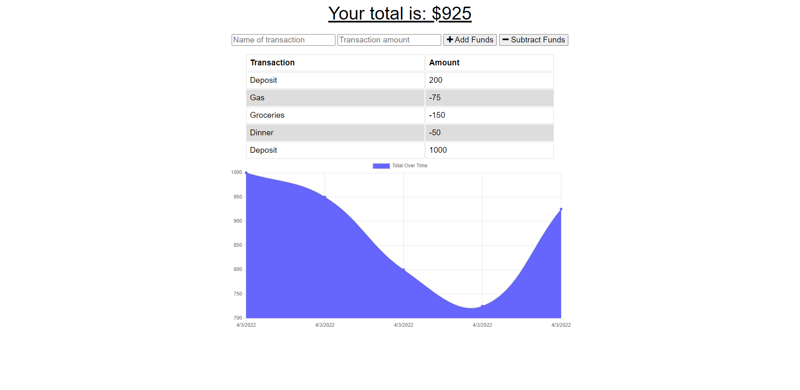

  # Budgets Made Simple

  ## Project Description
  This simple web app allows users to create transactions to track their money usage over time. It allows for both debit and credit transactions to the ledger along with a brief description of the transaction. A balance is calculated after each transaction is entered. This is perfect for tracking transactions while on the go!
  
  

  ## Usage
  After opening the app, simply start entering transactions. Very intuitive!

  ## Installation Guide
  Link to the app:
  [Budgets Made Simple](https://rocky-gorge-14136.herokuapp.com)
  
  ## Technologies
  * Node
  * Express
  * Mongo DB
  * Mongoose
  * JavaScript
  * PWA

  ## Licenses
  MIT

  ### GitHub
  [Jeremy O'Daniel](https://github.com/jeremyodaniel)

  ### Email
  jeremy.odaniel@gmail.com

